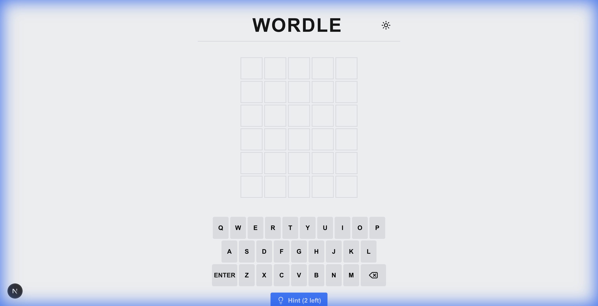

# Wordle Next

A hobby project exploring modern web development by recreating the popular [Wordle](https://www.nytimes.com/games/wordle/index.html) game mechanics. Built with **Next.js 16**, **Tailwind CSS v4**, and **TypeScript** for educational purposes.



## Features

-   **Game Logic**: Fully implemented Wordle engine with state management using custom `useWordle` hook.
-   **Animations**: Smooth tile entry, flip, and shake animations powered by Tailwind CSS.
-   **Dark Mode**: Native dark mode support using `next-themes` and a custom Tailwind v4 configuration.
-   **Play Again**: Instantly reset the game logic to play endless rounds.
-   **Hint System**: Integrated hint system (limited to 2 hints per game) to help unstuck players.
-   **Responsive Design**: Mobile-friendly layout using Tailwind's responsive utilities.

## Tech Stack

-   **Framework**: Next.js 16 (App Router)
-   **Styling**: Tailwind CSS v4
-   **Language**: TypeScript
-   **Icons**: Lucide React
-   **Notifications**: React Hot Toast

## Getting Started

1.  **Clone the repository**:
    ```bash
    git clone https://github.com/yourusername/wordle-next.git
    cd wordle-next
    ```

2.  **Install dependencies**:
    ```bash
    npm install
    ```

3.  **Run the development server**:
    ```bash
    npm run dev
    ```

4.  **Open the app**:
    Navigate to [http://localhost:3000](http://localhost:3000) (or the port shown in your terminal, usually 3001 if 3000 is taken).

## Project Structure

This project uses the `src/` directory convention:

-   `src/app`: Next.js App Router pages and layouts.
-   `src/components`: Reusable UI components (Board, Row, Keyboard, etc.).
-   `src/hooks`: Custom hooks (`useWordle` game logic).
-   `src/lib`: Helper functions and data constants (dictionaries).
